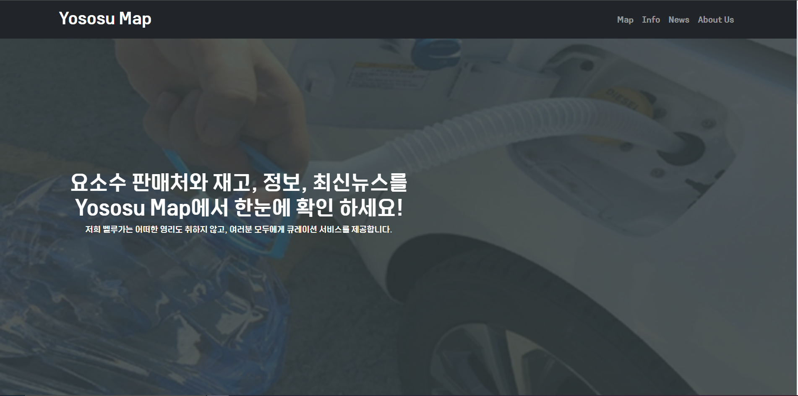

# 요소수 맵 - 팀프로젝트

>📢 요소수 판매처와 재고, 정보, 최신뉴스를 Yososu Map에서 한눈에 확인할 수 있습니다. 많은 이용바랍니다.💗 http://yososumap.ga/

 

## 💡 프로젝트 구상 계기
코로나맵, 마스크 알리미처럼 저희가 배운 지식을 기반으로 많은 사람들에게 큐레이션을 제공할 수 있는게 뭐가 있을까 고민하다가 요소수 대란으로 많은 분들이 힘들어 하시는것을 보고 그분들의 번거로움을 덜어 드리고 편리함을 제공 하고자 하는 마음에 제작하게 되었습니다.

## 💧 프로젝트 명
요소수 맵(Yososu Map)
-> 코로나맵에서 착안하여 요소수맵으로 정함

## 🐬 팀명
벨루가 (beluga)
-> 흰돌고래라는 뜻으로, 사람들에게 친근하고 사랑받는 개발자가 되어 좋은 서비스를 제공하자는 의미로 벨루가로 정함.

## 👥 팀원
- SangHoon : 기획, 요소수 지도 구현, 인프라 구축
- Seungwan : 요소수 뉴스 구현, 중계서버 도입
- Jisu : 팀원소개 구현, 총괄 디자인, 도메인설정
- Taekyu : 요소수 정보 구현, 크롤링 구현, SEO

## 🔈 프로젝트 설명
- 요소수맵(Yososu Map)은 요소수 관련 큐레이션을 제공하는 사이트 입니다.
- 지도를 통해 요소수 판매처, 재고, 가격, 연락처 등을 알 수 있습니다.
- 요소수, 요소수의 용도, 수입현황, 품귀현상이유 에 대한 정보들을 알 수 있습니다.
- 요소수에 대한 최신 뉴스들을 확인 할 수 있습니다. 
-> 위의 모든걸 한곳에서 한번에 확인할 수 있는 것이 장점!!!

## 📑 프로젝트 레이아웃
- 요소수 지도 ( Yososu Map )
- 요소수 정보 ( 요소수란 )
- 요소수 뉴스 ( yososu New )
- 팀원 소개 ( Our Team Member ) 
-> SPA 로 제작하였습니다. 
-> 총 4가지 섹션으로 구성 되어 있습니다.

## 🛠 기술 스택
- 프론트 : React, react-bootstrap
- 백앤드 : node.js - proxy(중계서버)
- 배포 : AWS, Docker, Nginx, IaC(Terraform, Ansible), Freenom
- 협업관리 : Notion, github
- 툴 : vsc, cmd(ssh - ubuntu)
- API : Kakao Map, Naver Search, 공공데이터포털(요소수)

## 📡배포 링크
> http://yososumap.ga/

- 공공데이터포털의 활용사례에도 등록되어 있습니다.
- 좀 더 편리한 CI/CD 환경을 위해 Jenkins도 추가 도입할 예정 입니다.
  

## 💎배포전 영상 미리보기

<iframe width="560" height="315" src="https://www.youtube.com/embed/x6R2NDhTmdM" title="YouTube video player" frameborder="0" allow="accelerometer; autoplay; clipboard-write; encrypted-media; gyroscope; picture-in-picture" allowfullscreen></iframe>

